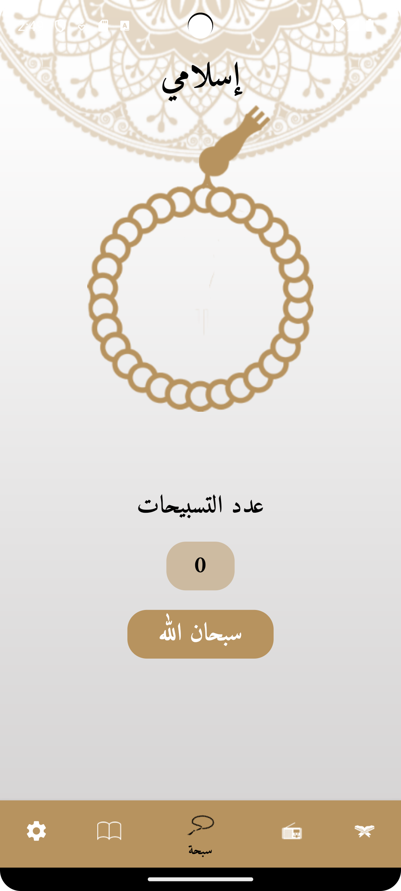

# Islamy

Islamy is a comprehensive Islamic application designed to cater to the spiritual needs of Muslims worldwide. The app provides a range of features to enhance your Islamic knowledge and daily practices, all within a user-friendly interface.

## Features
### Quran Screen
- Access the complete Quran with detailed information for each Surah (chapter). 
- Navigate easily between Surahs and Ayahs (verses) to read and understand the Quranic text.

  

    
    
  

### Hadeth Screen
- Explore a vast collection of Hadiths with detailed information for each Hadith. 
- Read and reflect on the sayings and teachings of the Prophet Muhammad (PBUH).

  

    
    
  

### Radio Screen
- Tune in to various Islamic radio stations through an integrated radio API. 
- Enjoy live streaming of Islamic lectures, Nasheeds, and more.

### Sebha Screen
- Use the digital Sebha to keep track of your Tasbeeh (recitations).
- Count and reset the counter for each Tasbeeh with ease.

### Settings Screen
- Customize the app according to your preferences.
- Change the language between Arabic and English.
- Switch between light and dark themes to suit your visual comfort.

